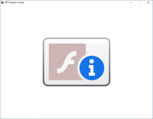
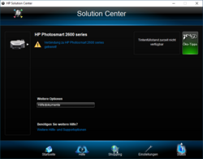

# Flash Fix for HP Solution Center

This tool changes the due date of the native Adobe Flash application by binary patching the executable. This is necessary for applications like HP Solution Center in order to keep them working after Flash's hardcoded due date (after 12 January 2021).  
The tool is built with C++ and Qt5.

The modified Flash binary turns the blocked HP Solution Center application  
  
back into its original state.  

**DISCLAIMER:** By setting the due date to infinity, you actively disable the kill-switch functionality of the native Flash application. This poses a potential security threat to your system.

## How to Use
 - Download this HP Flash Fix tool from the release page or compile it by yourself.
 - Start the tool and click `open file` to load the Flash binary.
   - On Windows x32 systems, the Flash binary is located at: `C:\Windows\system32\Macromed\Flash\Flash.ocx`
   - On Windows x64 systems, the Flash binary is located at: `C:\Windows\SysWOW64\Macromed\Flash\Flash.ocx`
 - Click `Set due date to infinity`.
 - Click `Save file to...` and save the patched file to a non-system directory.
 - Change the permission for the system Flash binary (`*\Macromed\Flash\Flash.ocx`) to gain write/full access.
 - Copy the patched file and replace the system Flash binary by the patched file.